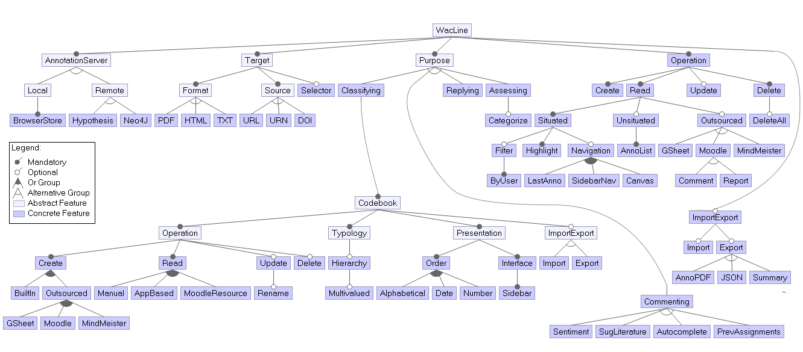
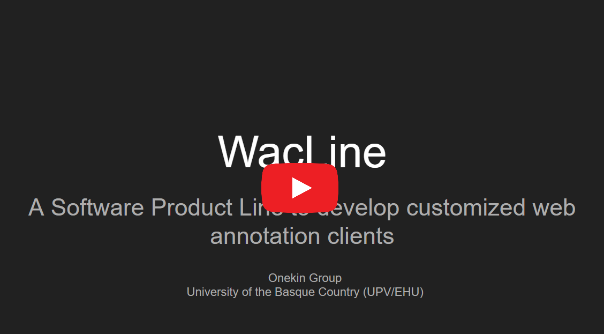
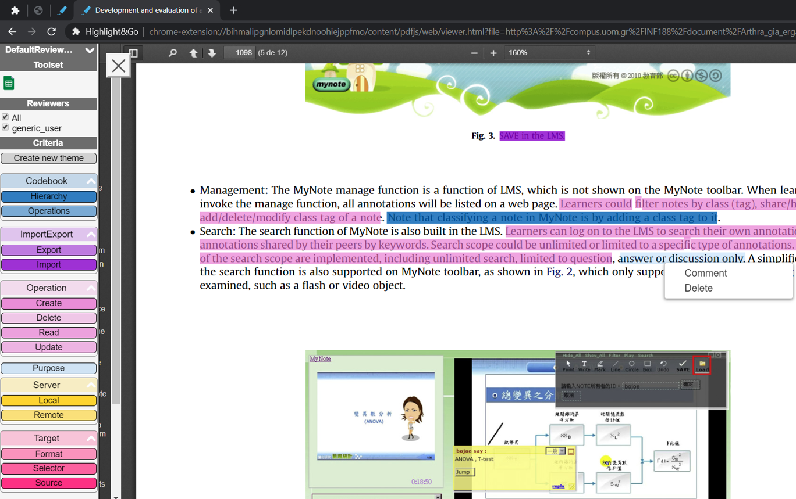
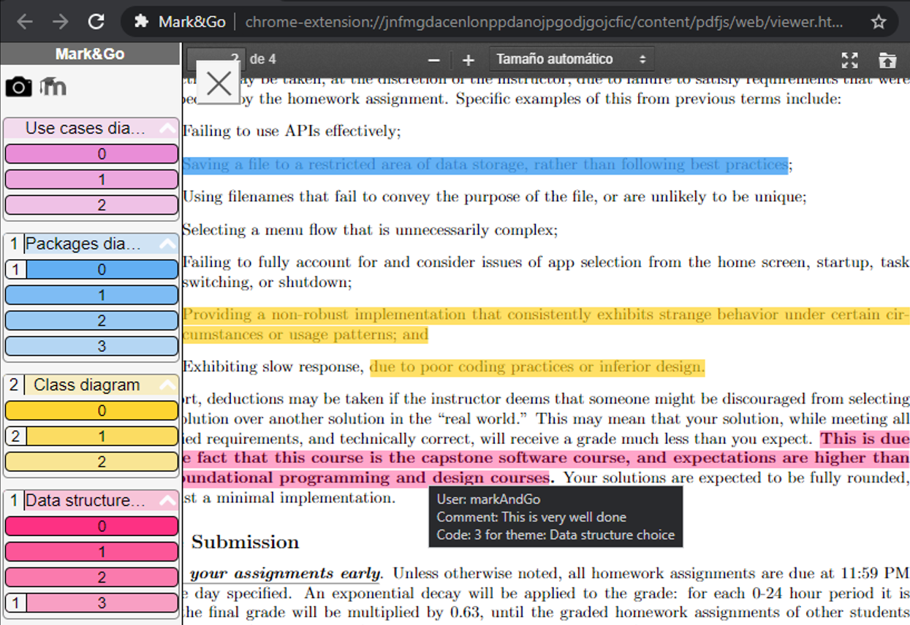
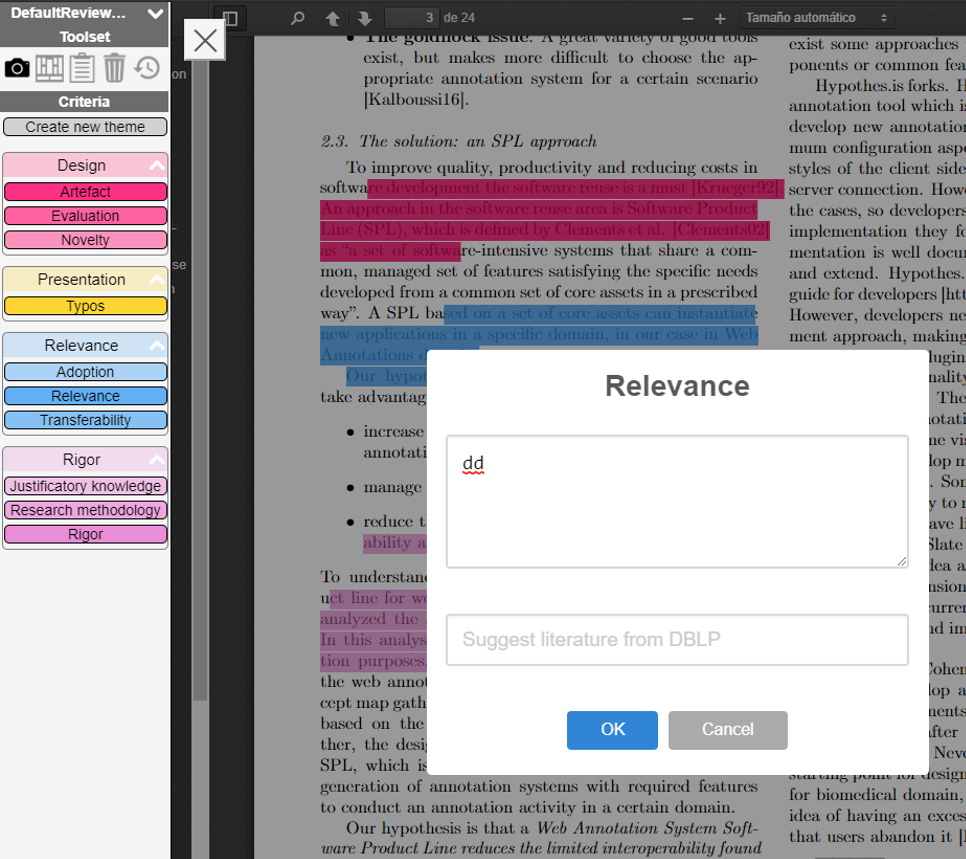

## WacLine
> Please note that this is a prototype under development. It is not thought to use in a production environment yet.

WacLine is a Software Product Line to manage heterogeneity in Web Annotation domain. Specifically, WacLine allows configuration and automatically generation of customized web annotation clients to conduct annotation activities in specific domains. Created annotation clients are browser extensions currently compatible with Chromium-like web browsers (Google Chrome, Opera,...).

## Feature model
The feature model establishes the features that product engineers can select and deselect to customize their own annotation client using WacLine.
The documentation for all the features can be found [here](./featureModel/). It includes a description and example (if needed) for each of the features implemented in WacLine.

In the following image you can see the feature model diagram with the most relevant features to customize a web annotation client.

## Configure your own product using WacLine
### Requirements
See the requirements for contributors and annotation clients developers [here](https://github.com/onekin/WacLine#requirements-for-contributors-and-annotation-clients-developers).

### Video
The following video demonstrates how to configure a product using WacLine.

## Available variants
### Highlight&Go [![Highlight&Go icon][highlightAndGoIcon]](https://rebrand.ly/highlightAndGo)
Highlight&Go is a web annotation client to facilitate data extraction in Secondary Studies.

### Mark&Go [![Mark&Go icon][markAndGoIcon]](https://rebrand.ly/markAndGo)
Mark&Go is a web annotation client to let teachers mark students assignments through semantic annotations based on evaluation rubrics.

### Review&Go [![Review&Go icon][reviewAndGoIcon]](https://rebrand.ly/reviewAndGo)
Review&Go is a web annotation client to review research papers using annotations.

[highlightAndGoIcon]: https://raw.githubusercontent.com/onekin/WacLine/master/input/app/images/hag/icon-38.png
[markAndGoIcon]: https://raw.githubusercontent.com/onekin/WacLine/master/input/app/images/mag/icon-38.png
[reviewAndGoIcon]: https://raw.githubusercontent.com/onekin/WacLine/master/input/app/images/rag/icon-38.png
